# 💫 About Me:

🔭 I’m currently working on **Enterprise AI/RAG systems, intelligent document ingestion pipelines, and full-stack applications**, with a focus on PDF parsing, table extraction, OCR, retrieval accuracy, and scalable AI-powered document processing.

👫 I’m looking to collaborate on **AI/RAG applications, document intelligence, full-stack web applications, microfrontend architectures, and open-source projects** that solve real-world problems.

🤝 I’m looking for help with **advanced RAG architectures, GraphRAG, knowledge graphs, LLM orchestration, document intelligence, and scalable AI systems**.

🌱 I’m currently learning **AI Engineering, advanced RAG, GraphRAG, Knowledge Graphs, LLM orchestration, document intelligence, system design, and scalable architectures**.

💬 Ask me about **Full-Stack Development, React, Node.js, TypeScript, .NET, PostgreSQL, REST APIs, Microfrontends, RAG, Qdrant, document ingestion, and PDF parsing**.

⚡ Fun fact: **I enjoy turning complex engineering problems into simple, scalable systems.**

---

# 🌐 Socials:

  
  
  

---

# 💻 Tech Stack:

### 👨‍💻 Languages

  

### 🎨 Frontend

  

### ⚙️ Backend

  

### 🗄️ Databases & Storage

  

### 🤖 AI / RAG

  

  
  
  
  
  

### 🛠️ Tools & DevOps

  

---

# 📊 GitHub Stats:
# 📊 GitHub Stats

  
  

  

---

# 📈 Contribution Graph:

  

